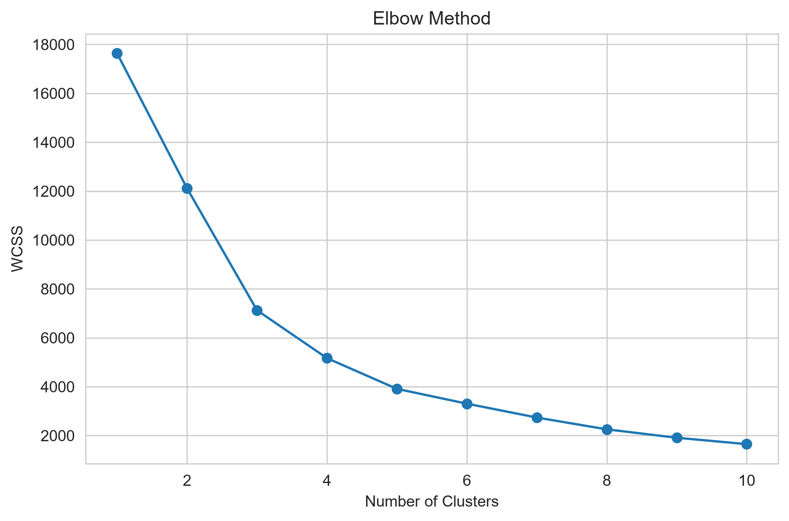
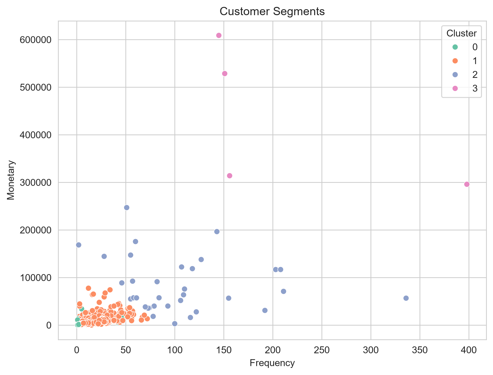
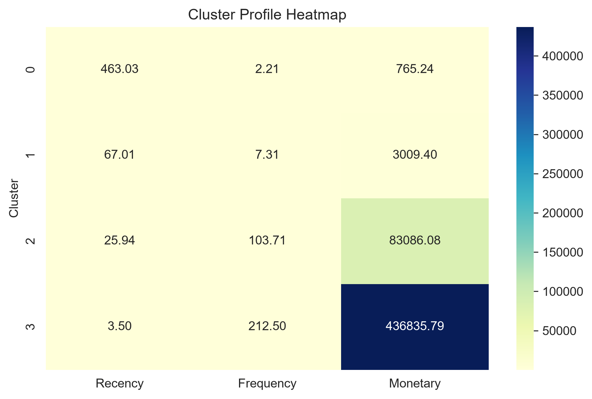
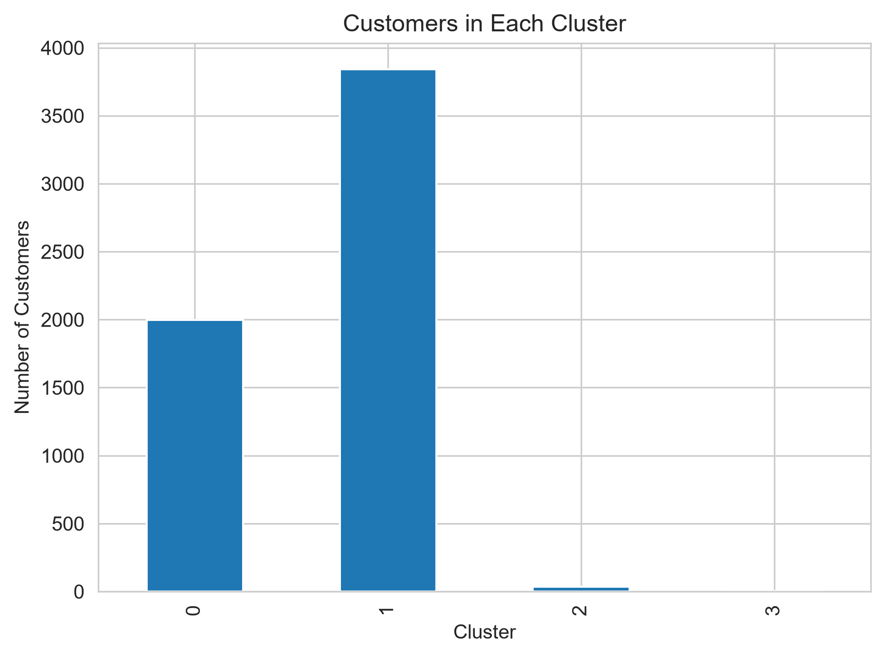

# Customer Segmentation using K-Means Clustering

## Project Overview

This project performs Customer Segmentation using RFM (Recency, Frequency, Monetary) Analysis and K-Means Clustering. The objective is to group customers based on their purchasing behaviour so businesses can implement targeted marketing strategies and improve customer retention.

---

## Dataset

- Dataset: Online Retail II
- Records: 1,067,371
- Features: 8

### Columns

- Invoice
- StockCode
- Description
- Quantity
- InvoiceDate
- Price
- Customer ID
- Country

---

## Technologies Used

- Python
- Pandas
- NumPy
- Matplotlib
- Seaborn
- Scikit-learn
- Jupyter Notebook

---

## Project Workflow

1. Data Loading
2. Data Cleaning
3. RFM Analysis
4. Data Standardization
5. Elbow Method
6. K-Means Clustering
7. Customer Segmentation
8. Cluster Profiling
9. Business Recommendations

---

## Visualizations

- Elbow Method
- Customer Segments Scatter Plot
- Cluster Profile Heatmap
- Customers per Cluster

---
## Screenshots

### Elbow Method

### Customer Segments

### Cluster Profile Heatmap

### Customers per Cluster

## Business Recommendations

- Reward VIP customers with loyalty programs.
- Increase engagement of regular customers through personalized offers.
- Re-engage inactive customers using discounts and email campaigns.
- Recommend relevant products to loyal customers to maximize customer lifetime value.

---

## Conclusion

Customer Segmentation was successfully performed using RFM Analysis and K-Means Clustering. Customers were divided into four distinct groups based on Recency, Frequency, and Monetary values. The insights obtained from this analysis can help businesses improve customer retention, optimize marketing campaigns, and increase revenue.

---

## Author

**Shivanand Prakash Birajdar**

Data Analytics Internship Project

Oasis Infobyte